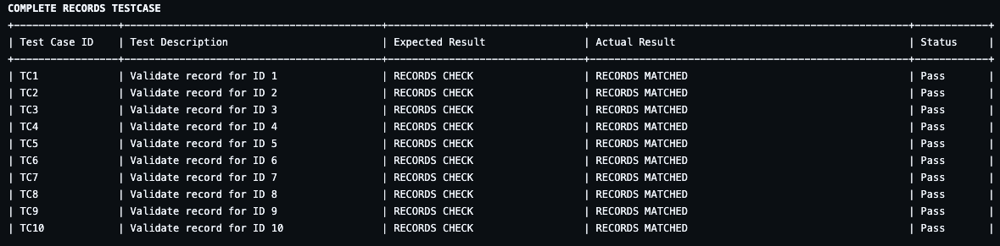
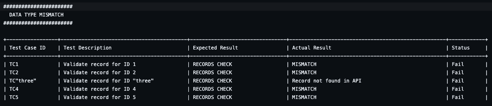
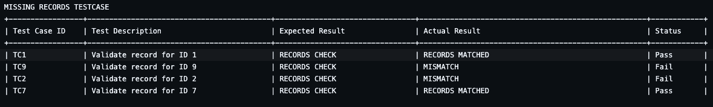

# Shell Script Assignment

## Project Overview
This project is designed to test and validate user data fetched from an API against predefined records stored in CSV files. The focus is on ensuring data integrity, matching records, detecting missing entries, and handling datatype mismatches. The project utilizes shell scripts for these validations, and a CI/CD pipeline powered by GitHub Actions to automate testing.

## Things to note
- Because it was not explicitly stated that the ID should be passed as a commandline argument, this project did not provide an implementation for such, rather it implemented an iteration method checks based on the Ids in the CSV file(s). 
- Directory referencing structures are different in all environments `(Linux (Ubuntu), MacOS and Windows)`, so it is mandated to make little tweaks if necessary. 
- The Repository conforms with Linux (Ubuntu) 
- The uploaded file `https://github.com/ken4ward/ShellScriptAssignment/blob/main/ShellScriptAssignment.zip` conforms with MacOS file structure.

## Setup
- **Clone ShellScriptAssignment Repository**: `git clone https://github.com/ken4ward/ShellScriptAssignment.git`
- **Change directory into project directory**: `cd ShellScriptAssignment`
- **Change directory into testcases folder**: `cd scripts/testcases`
- **Execute testcases**: Example: `sh complete_records.sh`

## Table of Contents
- [Project Overview](#project-overview)
- [Expectations](#expectations)
  - [1. Automate Data Validation Using Bash Script](#1-automate-data-validation-using-bash-script)
  - [2. Create a CSV Data File](#2-create-a-csv-data-file)
  - [3. Query an External Web API](#3-query-an-external-web-api)
  - [4. Validation Against CSV Data](#4-validation-against-csv-data)
  - [5. Bash Script Functionality](#5-bash-script-functionality)
  - [6. Automated Test Environment](#6-automated-test-environment)
  - [7. CI/CD Toolchain Integration](#7-cicd-toolchain-integration)
  - [8. Website and Data Choice](#8-website-and-data-choice)
- [Outcomes](#outcomes)
  - [1. Documentation](#1-documentation)
  - [2. Proposed CI/CD Solution](#2-proposed-cicd-solution)
- [Project Directory Structure](#project-directory-structure)
- [Test Scenarios](#test-scenarios)
  - [1. Complete Records Check](#1-complete-records-check)
  - [2. Missing Records Check](#2-missing-records-check)
  - [3. Data Type Mismatch Check](#3-data-type-mismatch-check)
- [Running Tests Locally](#running-tests-locally)


## Expectations

### 1. Automate Data Validation Using Bash Script
- **Objective**: Develop a bash script that automates the process of validating data fetched from an external web API against expected values in a CSV file.
- **Details**:
  - **How it's done**: The bash script should be written to:
    1. Read the unique key from the CSV file.
    2. Use the unique key to query an external web API.
    3. Fetch the corresponding data from the API.
    4. Compare the fetched data with the expected values in the CSV file.
    5. Output the result of the comparison to the console.

### 2. Create a CSV Data File
- **Objective**: Create a CSV file with at least 10 rows and 5 columns, representing the expected data for validation.
- **Details**:
  - **How it's done**:
    - Created a shell script to query, download and saved the result as a csv `users.csv` file in the `data` directory of the project. 
    - The file have columns such as `id`, `name`, `username`, `email`, `phone`, `website`, etc.
    - The users' record from `https://jsonplaceholder.typicode.com/users' is used.
      - CSV Records Sample:
      ```csv
        id,name,username,email,phone,website
        1,"Leanne Graham","Bret","Sincere@april.biz","1-770-736-8031 x56442","hildegard.org"
        2,"Ervin Howell","Antonette","Shanna@melissa.tv","010-692-6593 x09125","anastasia.net"
      ```
    - This file `users.csv` will serve as the baseline for comparison during validation.

### 3. Query an External Web API
- **Objective**: Implement functionality in the bash script to query an external web API using the unique key provided as input.
- **Details**:
  - **How it's done**:
    - Wrote a `shell script` that sends HTTP requests to the external API.
    - The API URL should be constructed accepting the unique key `id` from the CSV file.
    - Example:
      ```bash
      Example:
      api_response=$(curl -s "https://jsonplaceholder.typicode.com/users?id=$id")
      ```
    - The response is parsed to extract relevant fields for comparison.

### 4. Validation Against CSV Data
- **Objective**: Compare the fetched data from the API with the expected data in the CSV file.
- **Details**:
  - **How it's done**:
    - Implemented a comparison logic in the bash script.
    - For each field (e.g., `name`, `email, ...`), compare the value from the API response with the corresponding value in the CSV file.
    - Log the result as "Pass" if the values match, and "Fail" if they don't in console.
    - Example:
      ```bash
      if [ "$name" != "$api_name" ]; then
        echo "Test Failed: Name mismatch for user ID $id"
        echo "Expected: $name, Got: $api_name"
      ```

### 5. Bash Script Functionality
- **Objective**: Ensure the bash script is capable of taking a unique key `id` as an input parameter and printing the validation results.
- **Details**:
  - **How it's done**:
    - The script should be designed to accept `id` as the input parameter.
      - Example:
      ```bash
        get_api_user_data() {
          local user_id=$1
          echo "$api_data" | jq -r --argjson id "$user_id" '
          ...
        }
      ```
    - The script should output the test results to the console.

### 6. Automated Test Environment
- **Objective**: Describe the automated test environment, including the tools and setup used for running the bash script.
- **Details**:
  - **How it's done**:
    - This project is tested on `MacBook Pro 2017 (Ventura 13.6.7 OS)`, `Macbook pro M3 (Sonoma 14.5 OS)`, `Ubuntu (latest OS)` version on CICD
    - Ensure that `bash`, `curl` tools are installed.

### 7. CI/CD Toolchain Integration
- **Objective**: Propose a solution for integrating the bash script into a CI/CD pipeline.
- **Details**:
  - **How it's done**:
    - Used GitHub Actions as the CI/CD tool.
    - Created a pipeline configuration that triggers the bash script on code changes or at scheduled intervals.
    - The code is provided in this file of the project `.github/workflows/test.yml`

### 8. Website and Data Choice
- **Objective**: Select a suitable website for the web API and corresponding data for the CSV file.
- **Details**:
  - **How it's done**:
    - Chose a public API that provides data relevant to the test cases. JSONPlaceholder (https://jsonplaceholder.typicode.com/users).

## Outcomes

### 1. Documentation
- **Objective**: Provide comprehensive documentation that covers the automated test environment, the bash script, and the results of the test scenarios.
- **Details**:
  - **How it's done**:
    - For the project, Intellij IDEA is used. to experience a full feature to working with shell script projects, install necessary plugins:
      
      | Feature         | Description                                                                                           | Importance |
      |-----------------|-------------------------------------------------------------------------------------------------------|------------|
      | PowerShell      | Provides PowerShell code completion and script execution support                                       | Optional   |
      | Shell Filter    | To run an external shell command and insert or replace the returned output into the current Editor     | Optional   |
      | Shell Process   | Run a shell command on selected lines or the entire current buffer.                                    | Optional   |
      | Shell Script    | Coding assistance: code completion, quick documentation, code refactorings.                            | Important  |

    - How to run the script and interpret the results.
      - Go into the root directory of the project `ShellScriptAssignment` and change directory to `scripts/testcases`
      - Execute the testcases line by line.
      ```bash
        sh complete_records.sh
        sh datatype_mismatch.sh
        sh datatype_mismatch.sh
      ```

### 2. Proposed CI/CD Solution
- **Objective**: Present a well-thought-out solution for integrating the validation script within a CI/CD pipeline.
### Summary of CI/CD Setup with GitHub Actions
- **Create Workflow File**
  - Add a YAML file in `.github/workflows` (e.g., `ci-cd.yml`).

- **Define Workflow Configuration**
  - Name the workflow.
  - Set up triggers (e.g., `push`, `pull_request`).

- **Configure Job Steps**
  - **Checkout Code**: Use `actions/checkout` to fetch code.
  - **Set Up Dependencies**: Install necessary tools or dependencies.
  - **Run Tests**: Execute tests or build commands.
  - **Build and Deploy**: Build application and deploy.

- **Handle Secrets and Environment Variables**
  - Add secrets in GitHub repository settings.
  - Use secrets in the workflow file.

- **Monitor Workflow Runs**
  - Check workflow status and logs in the `Actions` tab.

## Project Directory Structure
```plaintext
  ShellScriptAssignment/
  ├── data/
  │   ├── complete_records.csv
  │   ├── missing_records.csv
  │   └── users.csv
  ├── scripts/
  │   ├── shared/
  │   │   ├── api_request.sh
  │   │   ├── constants.sh
  │   │   └── log_test_result.sh
  ├   |   |── load_dependencies.sh
  │   │   └── validation.sh
  │   └── testcases/
  │   |   ├── complete_records.sh
  │   |   ├── missing_records.sh
  │   |   └── datatype_mismatch.sh
  └   |── |── downloader/
  │       ├── csv_handler.sh
  │       ├── main.sh
  │       └── utils.sh
  └── README.md
  |
  |---.github
  └──workflows
  └──test.yml
  ```
## Test Scenarios

### 1. Complete Records Check
- **Objective**: Validate that all records in the CSV file have corresponding data in the API.
- **Details**:
  - **How it's done**:
    - The script should iterate through each row in the CSV file `users.csv`.
    - For each row, use the unique key to fetch data from the API.
    - Log a "Pass" if the data is complete and matches the expected values.

### 2. Missing Records Check
- **Objective**: Identify any field value missing in the records that are in the CSV file check against API record response.
- **Details**:
  - **How it's done**:
    - The script should iterate through each row in the CSV file `missing_records.csv`.
    - For each row, use the unique key (`id`) to fetch data from the API.
    - Validate there are no missing field values in each record iterated.
    - Log a "Pass" if there is no missing field value and "Fail" if there are.

### 3. Data Type Mismatch Check
- **Objective**: Check for any data type mismatches between the CSV file and the API response.
- **Details**:
  - **How it's done**:
  - The script should iterate through each row in the CSV file `datatype_mismatch.csv`.
  - For each row, use the unique key (`id`) to fetch data from the API.
  - Validate that datatype fields in the CSV file correspond to datatype data from the API.
  - Log a "Fail" if there is a data type mismatch and "Pass" is there is none.

## Running Tests Locally
- **Objective**: Provide instructions for running the tests on a local machine.
- **Details**:
  - **How it's done**:
    - There are 3 scenarios covered:
      - `complete_records.sh` validates all records in the CSV file `users.csv` to the returned records from the api
      - `datatype_mismatch.sh` validates it highlights all records that has a mismatch datatype in the `datatype_mismatch.csv`, a variation of `users.csv`.
      - `missing_records.sh` for a record pulled by an ID, it validates the expected records are complete as checked against this `missing_records.csv`, a variation of `users.csv`.
    - Execution Example: from the root directory of the project, change directory to ` cd scripts/testcases`
      ```bash
      sh complete_records.sh
      sh datatype_mismatch.sh
      sh datatype_mismatch.sh
      ```
  - The results will be displayed in the console formatted as a table.
  
  
  